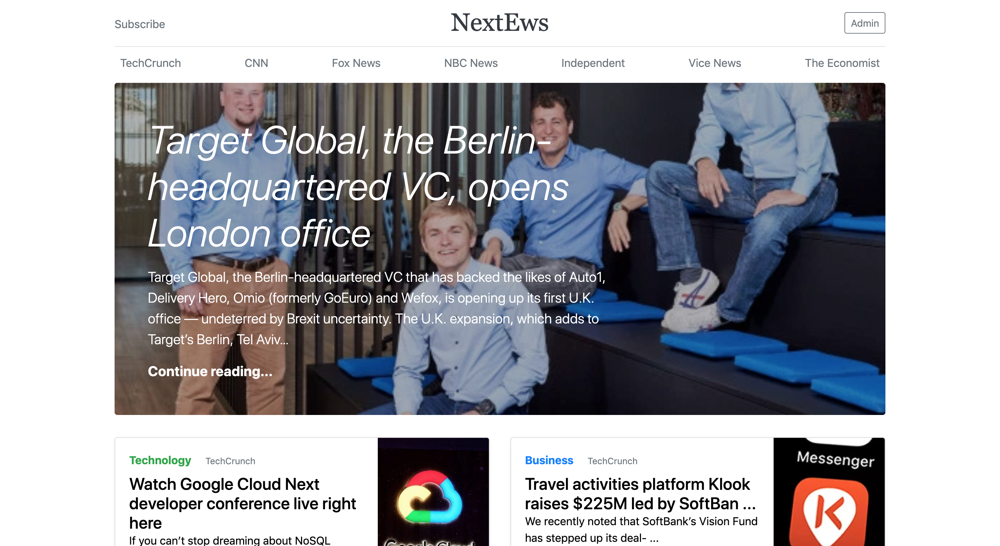
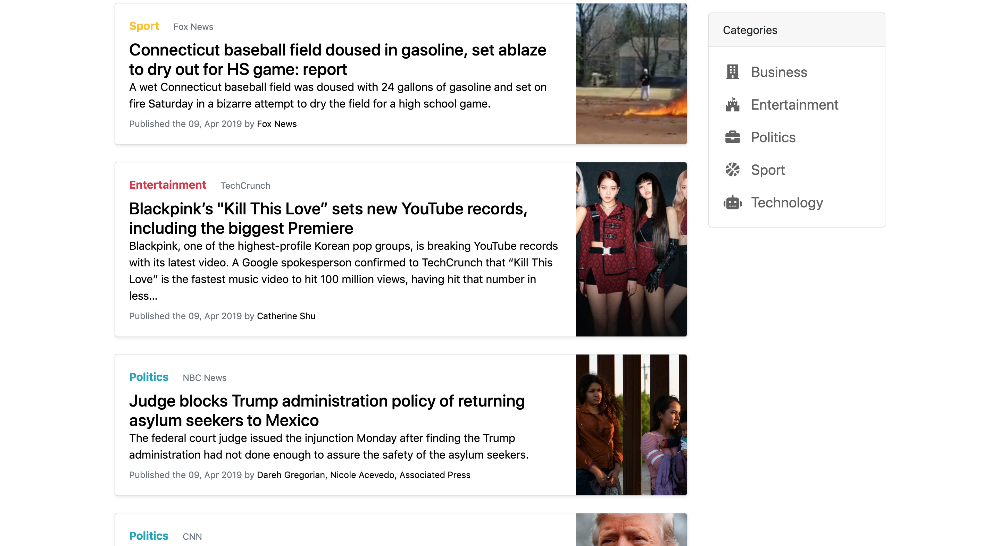
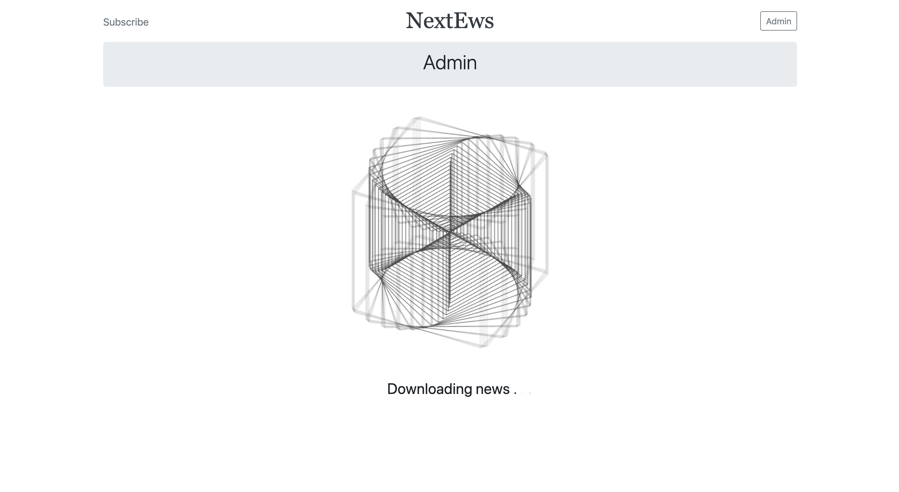
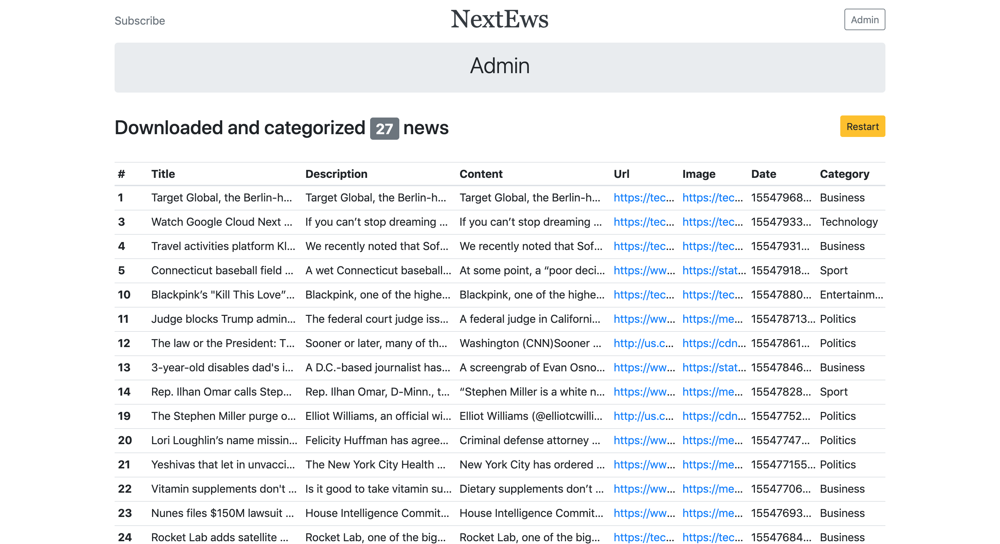
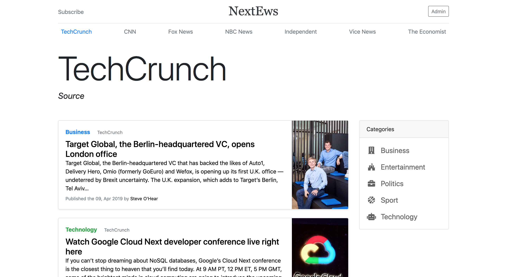

# NextEws
Flask website that make text classification using neural networks on news that permit to assign the right category (business, entertainment, politics, sport, technology) through a Convolutional NN. 

## Set up
To set up your flask application follow these steps:
* Run the setup `.\setup.sh`
* Set the flask information:
    * $ `export FLASK_APP=nextews`
    * $ `export FLASK_ENV=development`
    * $ `export FLASK_DEBUG=true`
* Set the virtual environment $ `source .env/bin/activate`
* Now you can start your flask app `flask run`

In case it gives you encoding problems, set in your bash:
* $ `export LC_ALL=en_us.UTF-8`
* $ `export LANG=en_us.UTF-8`

## Preview
Some previews of the website.
### Home 

### Classification  

### Source category 

## Contributing

When contributing to this repository, please first discuss the change you wish to make via issue,
email, or any other method with the owners of this repository before making a change. 

Please note we have a code of conduct, please follow it in all your interactions with the project.

### Pull Request Process

1. Ensure any install or build dependencies are removed before the end of the layer when doing a 
   build.
2. Update the README.md with details of changes to the interface, this includes new environment 
   variables, exposed ports, useful file locations and container parameters.
3. Increase the version numbers in any examples files and the README.md to the new version that this
   Pull Request would represent. The versioning scheme we use is [SemVer](http://semver.org/).
4. You may merge the Pull Request in once you have the sign-off of two other developers, or if you 
   do not have permission to do that, you may request the second reviewer to merge it for you.

## Versioning

#### Version: 1.0.0

We use [SemVer](http://semver.org/) for versioning.

## Authors
* **Alessandro Riccardi** - [Alericcardi](https://github.com/alericcardi)

## License

This project is licensed under the Apache 2.0 - see the [LICENSE](LICENSE) file for details.
